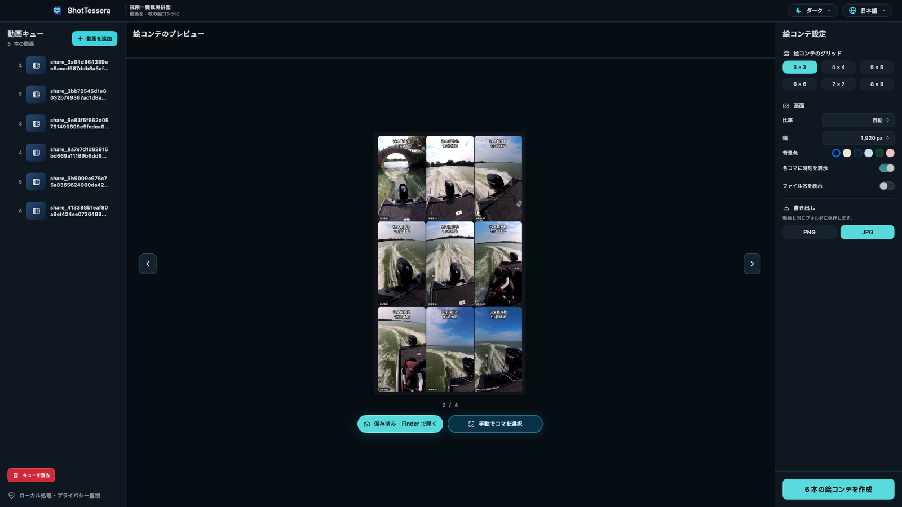

# 動画ワンクリック・スクリーンショットモンタージュ（ShotTessera）

[English](README.md) · [简体中文](README.zh-CN.md) · [日本語](README.ja.md)



**動画ワンクリック・スクリーンショットモンタージュ（ShotTessera）** は、動画から代表的なフレームを選び、一枚の見やすい絵コンテ画像にまとめるネイティブ macOS アプリです。

**まずスマート選択、必要なコマだけ手動調整。すべてローカルで完結します。**

> **最新リリース：**[v0.2.9 Universal DMG](https://github.com/ixiehao/ShotTessera/releases/tag/v0.2.9) · macOS 13 以降 · Apple Silicon / Intel Mac

## 一枚で分かる仕組み

| 1. 動画を追加 | 2. スマート選択、必要なら調整 | 3. 絵コンテを作成 | 4. ローカルに書き出し |
| --- | --- | --- | --- |
| 一つの動画、または複数の動画をキューに追加します。 | カットを検出し、黒画面・ぼやけ・重複を避け、必要なら候補を確認します。 | 3×3 から 8×8 のグリッドを一枚ずつリアルタイムに表示します。 | 元動画の横に PNG または JPG を保存します。 |

## 主な機能

- 大きなカット変化を検出し、顔や人物を含む有効なフレームを優先します。
- 黒画面、低精細、ほぼ同一の重複フレームを避けます。
- 既定では元動画の構図を保ちます。16:9、4:3、1:1、3:4、9:16、21:9 を選んでから、3×3 から 8×8 のグリッドを作成できます。
- 複数動画を追加し、キュー順に処理できます。各結果をリアルタイムでプレビューします。
- 生成後は別の候補フレームを確認し、スマート選択と手動調整を行って、元の出力設定で新しい画像として保存できます。
- 手動フレーム選択ウインドウを「プレーヤー + タイムライン + 候補ギャラリー」に再設計しました。
- 「画面」設定から絵コンテの背景色を選択できます。
- MP4、MOV、MPEG など、現在の macOS が対応する形式を扱えます。タイムコードと動画ファイル名タイトルは任意で表示できます。
- PNG/JPG、幅 1920 px 以上の書き出しに対応し、`動画名-shot-001.ext` の形式で安全に連番を付けます。
- English、中文、日本語の表示選択を記憶し、ライト、ダーク、またはシステムの外観に対応します。

## ダウンロード

[Homebrew](https://brew.sh/) を使用している場合：

```sh
brew install --cask ixiehao/tap/shottessera
```

または [最新リリース](https://github.com/ixiehao/ShotTessera/releases/latest)を開き、Apple Silicon / Intel Mac 対応のユニバーサル **DMG** をダウンロードします。

## 安全にインストールする


1. ダウンロードした `.dmg` をダブルクリックし、**视频一键截屏拼图.app** を「アプリケーション」へドラッグします。
2. コピー完了後、DMG は取り出しまたは削除できます。これはインストーラーなので、インストール済みアプリは削除されません。
3. このアプリはまだ Apple の公証を受けていません。開発元を確認できないと表示された場合は、「アプリケーション」で Control-click し、「開く」を選んで、もう一度「開く」を確認します。macOS 全体の安全設定は変更しないでください。

あとで削除する場合は、アプリを終了してから「アプリケーション」の `视频一键截屏拼图.app` だけをゴミ箱へ移動します。書き出した画像は元動画の横に残ります。

## プライバシー優先

解析と書き出しはすべてローカルで行われます。アカウント、テレメトリー、クラウドアップロード、Electron、FFmpeg、Python ランタイムは含まれません。任意の更新確認は GitHub の公開リリース情報のみを読み取り、動画や利用データを送信しません。

## プロジェクトとフィードバック

- 開発者：[ixiehao](https://github.com/ixiehao)
- ソース、ダウンロード、リリースノート：[github.com/ixiehao/ShotTessera](https://github.com/ixiehao/ShotTessera)
- 不具合報告・提案：[GitHub Issue を作成](https://github.com/ixiehao/ShotTessera/issues/new/choose)
- 更新履歴：[CHANGELOG.md](CHANGELOG.md) · プライバシー：[PRIVACY.md](PRIVACY.md) · 命名規約：[docs/NAMING.md](docs/NAMING.md)

## 権利とライセンス

- Swift ソース、文書、Tessera Iris アイコンは本プロジェクトのオリジナルであり、[MIT License](LICENSE) で公開されています。
- アプリは Apple SDK フレームワークだけを使用し、第三者のアプリケーションコード、パッケージ、分析 SDK、MoviePrint 素材を含みません。
- ファイル名タイトルには同梱の **Noto Sans CJK SC Bold 2.004** を使用します。このフォントは改変せず、[SIL Open Font License 1.1](ThirdPartyLicenses/NotoSansCJK-OFL-1.1.txt) の下で別途ライセンスされています。帰属と検証情報は [NOTICE.md](NOTICE.md) を参照してください。
- 動画そのもの、動画内の字幕、商標、透かし、音楽などの権利は各権利者に帰属します。絵コンテの生成は公開または再配布の権利を付与しません。
- 適用される現地の法令を守り、あなたが所有する、または処理する権限のある動画だけを扱ってください。このリポジトリ監査は技術情報であり、法的助言ではありません。
