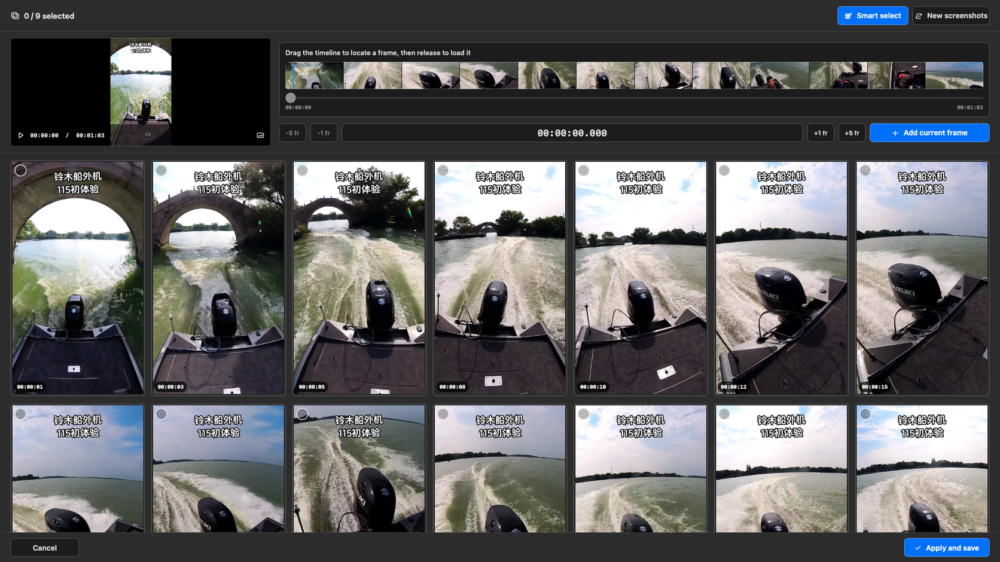

# ShotTessera

[English](README.md) · [简体中文](README.zh-CN.md) · [日本語](README.ja.md)

ShotTessera は、動画から代表的なフレームを選び、一枚の見やすい絵コンテ画像にまとめるネイティブ macOS アプリです。`tessera` はモザイクを構成する小片を意味します。

中国語名は **视频一键截屏拼图** です。動画スクリーンショット、動画コンタクトシート、絵コンテ作成、動画フレーム抽出のための macOS ツールとして検索できます。

## 一枚で分かる仕組み

| 1. 動画を追加 | 2. フレームを選択 | 3. シートを作成 | 4. ローカルに書き出し |
| --- | --- | --- | --- |
| 一つの動画、または複数の動画をキューに追加します。 | カットを検出し、黒画面・ぼやけ・重複を避け、人物がある場合は優先します。 | 3×3 から 8×8 のグリッドを一枚ずつリアルタイムに表示します。 | 元動画の横に、幅 1920 px 以上の PNG または JPG を保存します。 |

## 主な機能

- 大きなカット変化を検出し、顔や人物を含む有効なフレームを優先します。
- 黒画面、低精細、ほぼ同一の重複フレームを避けます。
- 3×3 から 8×8 のグリッド、PNG/JPG、幅 1920 px 以上の書き出しに対応します。
- 複数動画を追加し、キュー順に処理できます。右側にはフレームが一枚ずつリアルタイム表示されます。
- MP4、MOV、M4V、AVI、MKV、WebM、3GP/3G2、MPEG、TS/M2TS、WMV、FLV などの一般的なコンテナを選択できます。実際の再生可否は macOS がその動画コーデックを解読できるかに依存します。
- 各フレームに元動画のタイムコードを表示できます。
- タイトルは既定でオフです。アプリ内の「标题」スイッチをオンにすると、拡張子を除く動画ファイル名を、中央の半透明太字タイトルとして書き出し画像に重ねます。
- 出力は動画と同じフォルダに `動画名-shot-001.ext` の形式で保存され、番号は安全に連番になります。

解析と書き出しはすべてローカルで行われます。アカウント、テレメトリー、ネットワーク通信、クラウドアップロード、Electron、FFmpeg、Python ランタイムは含まれません。

## ダウンロードして使う

1. [最新リリース](https://github.com/ixiehao/ShotTessera/releases/latest)を開き、Apple Silicon Mac 用の **DMG** をダウンロードします。
2. DMG を開き、**视频一键截屏拼图** を「アプリケーション」フォルダへドラッグします。
3. アプリを開き、動画を一つ以上選択するかドラッグ＆ドロップします。

Apple Silicon Mac と macOS 13 以降が必要です。アプリは ad-hoc 署名済みですが Apple の公証は受けていません。初回起動時に Gatekeeper の警告が出る場合は、Control-click して「開く」を選んでください。

## 権利と帰属

- このリポジトリの Swift ソース、文書、Tessera Iris アイコンは本プロジェクトのオリジナルであり、[MIT License](LICENSE) で公開されています。
- アプリは Apple SDK フレームワークだけを使用し、第三者のアプリケーションコード、パッケージ、分析 SDK、ネットワーククライアント、MoviePrint の素材を含みません。
- タイトルには同梱の **Noto Sans CJK SC Bold 2.004** を使用します。このフォントは改変せずに **SIL Open Font License 1.1** の下で配布され、商用ソフトウェアへの埋め込みと再配布が可能です。帰属、版、ハッシュは [NOTICE.md](NOTICE.md)、完全なライセンスは [こちら](ThirdPartyLicenses/NotoSansCJK-OFL-1.1.txt) を参照してください。
- 動画そのもの、動画内の字幕、商標、透かし、音楽などの権利は各権利者に帰属します。絵コンテの生成は公開または再配布の権利を付与しません。

これはリポジトリ内のソースと同梱素材に対する技術的な監査であり、個別の動画や配布方法についての法的助言ではありません。

## ライセンス

プロジェクトのコードとオリジナル資産は [MIT License](LICENSE) です。同梱の Noto フォントには、別途 [SIL Open Font License 1.1](ThirdPartyLicenses/NotoSansCJK-OFL-1.1.txt) が適用されます。
