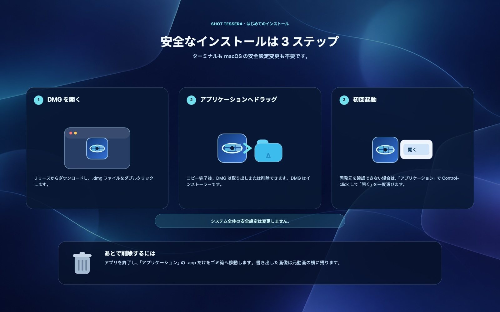

# ShotTessera

[English](README.md) · [简体中文](README.zh-CN.md) · [日本語](README.ja.md)


ShotTessera は、動画から代表的なフレームを選び、一枚の見やすい絵コンテ画像にまとめるネイティブ macOS アプリです。`tessera` はモザイクを構成する小片を意味します。

**まずスマート選択、必要なコマだけ手動調整。すべてローカルで完結します。**

別名は **视频一键截屏拼图** です。動画スクリーンショット、動画コンタクトシート、絵コンテ作成、動画フレーム抽出のための macOS ツールとして検索できます。

> **最新リリース：**[v0.2.5 Universal DMG](https://github.com/ixiehao/ShotTessera/releases/tag/v0.2.5) · macOS 13 以降 · Apple Silicon / Intel Mac

## 一枚で分かる仕組み

| 1. 動画を追加 | 2. スマート選択、必要なら調整 | 3. シートを作成 | 4. ローカルに書き出し |
| --- | --- | --- | --- |
| 一つの動画、または複数の動画をキューに追加します。 | カットを検出し、黒画面・ぼやけ・重複を避け、必要なら個別のコマだけ手動で置き換えます。 | 3×3 から 8×8 のグリッドを一枚ずつリアルタイムに表示します。 | 元動画の横に、幅 1920 px 以上の PNG または JPG を保存します。 |

## 主な機能

- 大きなカット変化を検出し、顔や人物を含む有効なフレームを優先します。
- 黒画面、低精細、ほぼ同一の重複フレームを避けます。
- 既定では、元動画の縦長・正方形・横長の構図を保ちます。16:9、4:3、1:1、3:4、9:16、21:9 を手動で選んでから、3×3 から 8×8 のグリッドを作成することもできます。PNG/JPG、幅 1920 px 以上の書き出しに対応します。
- 複数動画を追加し、キュー順に処理できます。右側にはフレームが一枚ずつリアルタイム表示されます。
- 生成後は軽量な手動セレクターを開き、スマート選択を保ちながら必要なコマだけ差し替えて、適用・保存できます。
- MP4、MOV、MPEG などに対応します。実際のデコードは macOS のコーデック対応に依存します。
- 各フレームに元動画のタイムコードを表示できます。
- タイトルは既定でオフです。アプリ内の「标题」スイッチをオンにすると、拡張子を除く動画ファイル名を、中央の半透明太字タイトルとして書き出し画像に重ねます。
- アプリ上部から中文・English・日本語の表示を切り替えられ、選択は記憶されます。
- 出力は動画と同じフォルダに `動画名-shot-001.ext` の形式で保存され、番号は安全に連番になります。

解析と書き出しはすべてローカルで行われます。アカウント、テレメトリー、クラウドアップロード、Electron、FFmpeg、Python ランタイムは含まれません。任意の更新確認は GitHub の公開リリース情報のみを読み取り、動画や利用データを送信しません。

## ダウンロード

[Homebrew](https://brew.sh/) を使用している場合：

```sh
brew install --cask ixiehao/tap/shottessera
```

または [最新リリース](https://github.com/ixiehao/ShotTessera/releases/latest)を開き、Apple Silicon / Intel Mac 対応のユニバーサル **DMG** をダウンロードします。

## 安全にインストールする



1. ダウンロードした `.dmg` をダブルクリックし、**视频一键截屏拼图.app** を「アプリケーション」へドラッグします。
2. コピー完了後、DMG は取り出しまたは削除できます。これはインストーラーなので、インストール済みアプリは削除されません。
3. このアプリはまだ Apple の公証を受けていません。開発元を確認できないと表示された場合は、「アプリケーション」で Control-click し、「開く」を選んで、もう一度「開く」を確認します。macOS 全体の安全設定は変更しないでください。

あとで削除する場合は、アプリを終了してから「アプリケーション」の `视频一键截屏拼图.app` だけをゴミ箱へ移動します。書き出した画像は元動画の横に残ります。Apple Silicon または Intel Mac と macOS 13 以降が必要です。

## プロジェクトとフィードバック

- 開発者：[xao](https://github.com/ixiehao)
- ソース、ダウンロード、リリースノート：[github.com/ixiehao/ShotTessera](https://github.com/ixiehao/ShotTessera)
- 不具合報告・提案：[GitHub Issue を作成](https://github.com/ixiehao/ShotTessera/issues/new/choose)
- 更新履歴：[CHANGELOG.md](CHANGELOG.md) · プライバシー：[PRIVACY.md](PRIVACY.md)

## 権利と帰属

- このリポジトリの Swift ソース、文書、Tessera Iris アイコンは本プロジェクトのオリジナルであり、[MIT License](LICENSE) で公開されています。
- アプリは Apple SDK フレームワークだけを使用し、第三者のアプリケーションコード、パッケージ、分析 SDK、MoviePrint の素材を含みません。更新確認は GitHub の公開リリース API のみを使用します。
- タイトルには同梱の **Noto Sans CJK SC Bold 2.004** を使用します。このフォントは改変せずに **SIL Open Font License 1.1** の下で配布され、商用ソフトウェアへの埋め込みと再配布が可能です。帰属、版、ハッシュは [NOTICE.md](NOTICE.md)、完全なライセンスは [こちら](ThirdPartyLicenses/NotoSansCJK-OFL-1.1.txt) を参照してください。
- 動画そのもの、動画内の字幕、商標、透かし、音楽などの権利は各権利者に帰属します。絵コンテの生成は公開または再配布の権利を付与しません。
- 適用される現地の法令を守り、あなたが所有する、または処理する権限のある動画だけを扱ってください。

これはリポジトリ内のソースと同梱素材に対する技術的な監査であり、個別の動画や配布方法についての法的助言ではありません。

## ライセンス

プロジェクトのコードとオリジナル資産は [MIT License](LICENSE) です。同梱の Noto フォントには、別途 [SIL Open Font License 1.1](ThirdPartyLicenses/NotoSansCJK-OFL-1.1.txt) が適用されます。

協力方法は [CONTRIBUTING.md](CONTRIBUTING.md) を参照してください。参加前に [CODE_OF_CONDUCT.md](CODE_OF_CONDUCT.md) もお読みください。
