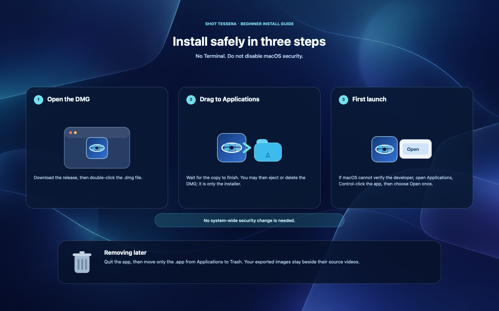

# ShotTessera（视频一键截屏拼图）

[English](README.md) · [简体中文](README.zh-CN.md) · [日本語](README.ja.md)


**ShotTessera（视频一键截屏拼图）** is a native macOS app that selects representative video frames and turns them into one clean storyboard image.

**Smart selection first. Fine-tune any frame. Export entirely locally.**

> **Latest release:** [v0.2.8 universal DMG](https://github.com/ixiehao/ShotTessera/releases/tag/v0.2.8) · macOS 13+ · Apple Silicon and Intel

## At a glance

| 1. Add videos | 2. Smart-select, then fine-tune | 3. Build the storyboard | 4. Export locally |
| --- | --- | --- | --- |
| Add one video or queue several. | Detect cuts and avoid black, blurry, and duplicate frames; inspect alternatives when needed. | Preview 3×3 to 8×8 grids while each storyboard is built. | Save a PNG or JPG beside the source video. |

## Features

- Detects meaningful scene changes and prioritises usable frames containing faces or people.
- Skips black, low-sharpness, and near-duplicate frames.
- Keeps the source composition by default; choose 16:9, 4:3, 1:1, 3:4, 9:16, or 21:9 before creating a 3×3 to 8×8 grid.
- Queues multiple videos and processes them in order, with live preview for each result.
- Lets you browse another candidate set, use Smart Select, and fine-tune frames before saving again with the original output settings.
- Redesigned the manual frame editor as a player, timeline, and candidate gallery.
- Choose a storyboard background colour in Frame settings.
- Supports MP4, MOV, MPEG, and other formats supported by macOS; optional timecodes and filename titles are available.
- Exports PNG or JPG at 1920 px or wider as `video-name-shot-001.ext`, incrementing safely when needed.
- Remembers your English, 中文, or 日本語 interface choice and supports light, dark, or system appearance.

## Download

With [Homebrew](https://brew.sh/):

```sh
brew install --cask ixiehao/tap/shottessera
```

Or open [the latest release](https://github.com/ixiehao/ShotTessera/releases/latest) and download the universal **DMG**.

## Install safely



1. Double-click the downloaded `.dmg`, then drag **视频一键截屏拼图.app** to **Applications**.
2. After the copy finishes, eject or delete the DMG. It is only the installer and does not remove the installed app.
3. The app is not Apple-notarized yet. If macOS cannot verify the developer, open **Applications**, Control-click the app, choose **Open**, then choose **Open** once more. Do not disable macOS system-wide security.

To remove it later, quit the app and move only `视频一键截屏拼图.app` from Applications to Trash. Exported images remain beside their source videos.

## Private by design

All frame analysis and export happen on your Mac. ShotTessera has no account, telemetry, cloud upload, Electron, FFmpeg, or Python runtime. Its optional update check reads only public GitHub release metadata; it never sends video or usage data.

## Project and feedback

- Developer: [xao](https://github.com/ixiehao)
- Source, downloads, and release notes: [github.com/ixiehao/ShotTessera](https://github.com/ixiehao/ShotTessera)
- Feedback and feature ideas: [open a GitHub issue](https://github.com/ixiehao/ShotTessera/issues/new/choose)
- What changed: [CHANGELOG.md](CHANGELOG.md) · Privacy promise: [PRIVACY.md](PRIVACY.md) · Product naming: [docs/NAMING.md](docs/NAMING.md)

## Rights and license

- Swift source, documentation, and the Tessera Iris icon are original project work released under the [MIT License](LICENSE).
- The app uses Apple SDK frameworks only; it bundles no third-party application code, packages, analytics SDKs, or MoviePrint assets.
- The filename title uses the bundled **Noto Sans CJK SC Bold 2.004** font, unmodified and separately licensed under the [SIL Open Font License 1.1](ThirdPartyLicenses/NotoSansCJK-OFL-1.1.txt). See [NOTICE.md](NOTICE.md) for attribution and verification details.
- Rights to source videos, subtitles, marks, watermarks, and music remain with their respective owners. Generating a storyboard does not grant publication or redistribution rights.
- Follow applicable local law and process only videos you own or are authorised to analyse. This repository audit is technical information, not legal advice.
