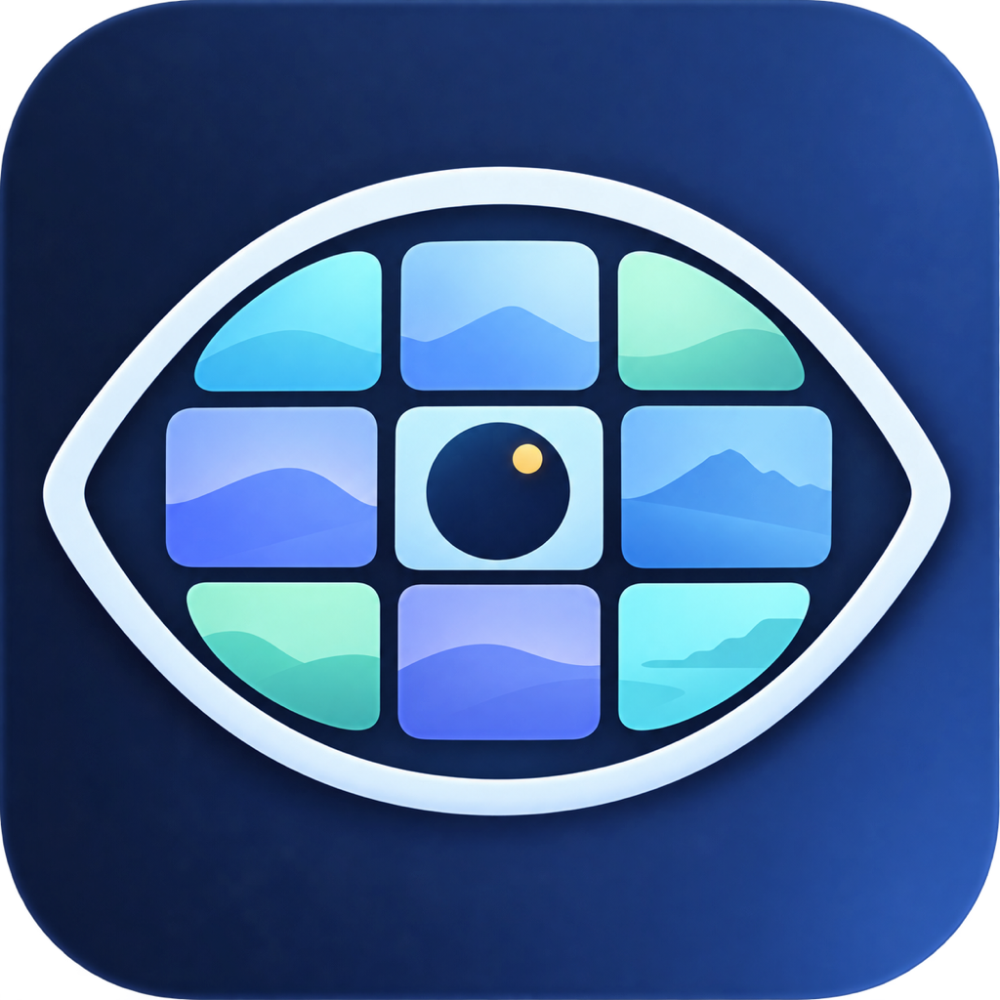

# ShotTessera

ShotTessera is a small, native macOS app that turns a video into one clean storyboard image. Its name joins **shot** with **tessera**, a small tile in a mosaic: selected video shots arranged into one visual whole.

It uses only Apple frameworks (`SwiftUI`, `AVFoundation`, `Vision`, `CoreGraphics`, and `CoreImage`): no Electron, FFmpeg, Python runtime, analytics, network requests, or cloud upload.

## What it does

- Detects visual shot changes and selects a representative frame for each scene.
- Prefers usable shots with a visible face or person; falls back gracefully for videos without people.
- Rejects near-black, low-detail, and near-duplicate frames.
- Creates 3×3 through 9×9 rounded-card storyboard grids.
- Exports PNG or JPEG at 1920 px wide or larger.

ShotTessera is an independent project. Its name, three-bar mark, and interface are original; it is not affiliated with Apple, MoviePrint, or any video service.

## App icon

The original **Tessera Iris** icon is an abstract viewfinder: nine rounded storyboard tiles form an eye, with the central pupil and gold highlight representing the selected representative frame. The app loads the 1024 px PNG at launch; a standard macOS [`.icns` package](Assets/ShotTessera.icns) and its [iconset](Assets/AppIcon.iconset) are included for future app-bundle packaging.



## Requirements

- macOS 13 or later
- Xcode 15 or later to build and run

## Run locally

1. Clone the repository.
2. Open `Package.swift` in Xcode.
3. Choose **ShotTessera** as the scheme and press Run.
4. Drop an MP4, MOV, or other AVFoundation-supported video into the window.

To run the algorithm tests from Terminal:

```sh
swift test
```

## Privacy

Every frame is decoded and analysed locally. ShotTessera has no account, telemetry, network client, or upload path.
See [PRIVACY.md](PRIVACY.md) for the complete statement.

## Responsible use

Only process video you own or are authorised to analyse. ShotTessera does not grant rights to copy, publish, or redistribute the source video or generated images.

## Selection approach

ShotTessera is intentionally lightweight. It identifies scene boundaries from compact luminance histograms, assesses exposure/sharpness/duplication from small pixel buffers, and uses Apple's on-device Vision people and face detectors as a preference signal. It uses a strict de-duplication pass first, then fills sparse source material from distributed timestamps so a requested grid never has blank cards. It does not claim to make subjective editorial decisions about a film's best performance or story beat.

## License

[MIT](LICENSE)
