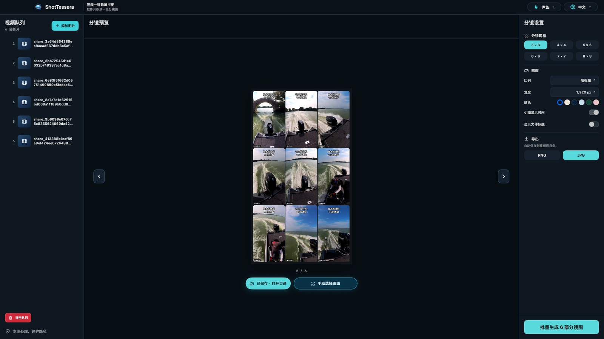
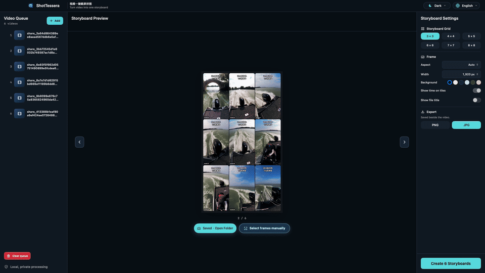
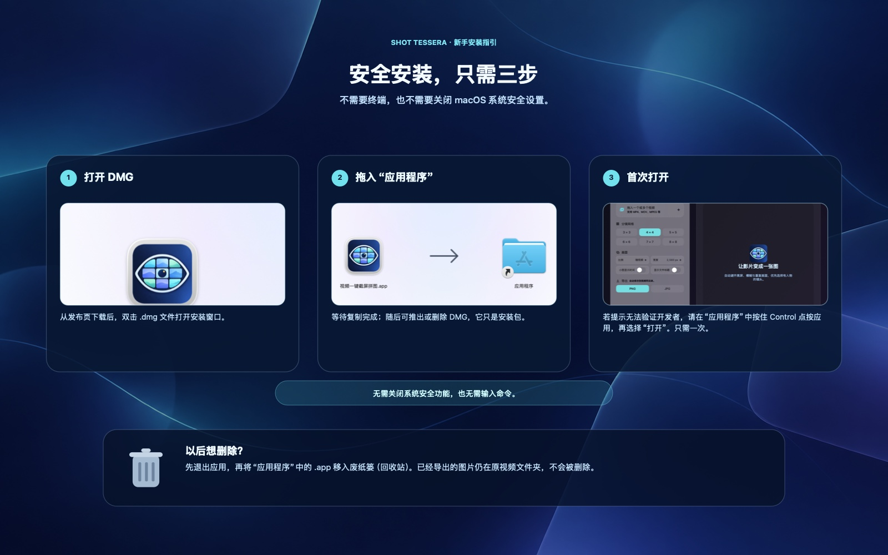

# 视频一键截屏拼图（ShotTessera）

[English](README.md) · [简体中文](README.zh-CN.md) · [日本語](README.ja.md)



**视频一键截屏拼图（ShotTessera）** 是一款原生 macOS 应用：从视频中挑选有代表性的画面，拼成一张干净的分镜图。

**先智能选帧，再手动微调；全程本地完成。**

> **最新版：**[v0.2.9 通用 DMG](https://github.com/ixiehao/ShotTessera/releases/tag/v0.2.9) · macOS 13+ · Apple Silicon 与 Intel Mac

## 一张图看懂功能

| 1. 添加视频 | 2. 智能挑帧，再微调 | 3. 生成分镜图 | 4. 本地导出 |
| --- | --- | --- | --- |
| 选择一个视频，或一次加入多个视频。 | 识别转场，避开黑屏、模糊与重复画面；需要时查看候选画面。 | 3×3 至 8×8 网格逐张实时预览。 | 在视频同目录保存 PNG 或 JPG。 |

### 看看实际操作

下方是真实软件操作：从已完成的分镜图进入手动选帧窗口，在可视化时间轴上定位画面，再从候选区选择更合适的一帧后保存。



## 功能

- 自动识别明显的镜头变化，优先选择有面部或人物的有效画面。
- 跳过黑屏、低清晰度和近似重复的画面。
- 默认完整保留视频构图；也可选择 16:9、4:3、1:1、3:4、9:16、21:9，再生成 3×3 至 8×8 分镜网格。
- 可一次添加多个视频，按队列顺序处理；每个结果均有实时预览。
- 生成后可浏览另一组候选画面，使用智能选择并按需微调，再按原结果的输出设置另存新图。
- 手动选帧窗口重做为“播放器 + 时间线 + 候选画廊”。
- 可在“画面”设置中选择分镜图底色。
- 支持 MP4、MOV、MPEG 等当前 macOS 支持的格式；可选显示时间码和视频文件名标题。
- 支持 PNG、JPG 和最低 1920 px 宽度导出，命名为 `视频名-shot-001.ext`，序号会安全递增。
- 可记住 English、中文、日本語界面选择，并支持浅色、深色或跟随设备显示模式。

## 下载

如已安装 [Homebrew](https://brew.sh/)，可直接执行：

```sh
brew install --cask ixiehao/tap/shottessera
```

也可打开[最新发布页](https://github.com/ixiehao/ShotTessera/releases/latest)，下载适用于 Apple Silicon 或 Intel Mac 的通用 **DMG**。

## 安全安装



1. 双击下载的 `.dmg`，将 **视频一键截屏拼图.app** 拖进“应用程序”。
2. 复制完成后可推出或删除 DMG；它只是安装包，不会删除已经安装的应用。
3. 应用尚未经过 Apple 公证。若系统提示无法验证开发者，请在“应用程序”中按住 Control 点按应用，选择“打开”，再确认一次“打开”。无需关闭 macOS 的系统级安全设置。

之后如需卸载，先退出应用，再将“应用程序”中的 `视频一键截屏拼图.app` 移入废纸篓（回收站）。已经导出的图片仍在原视频文件夹中。

## 隐私优先

所有分析和导出均在本机完成。项目不包含账号、遥测、云上传、Electron、FFmpeg 或 Python 运行时；可选的更新检查只读取 GitHub 公开版本信息，不会上传视频或使用数据。

## 项目与反馈

- 开发者：[ixiehao](https://github.com/ixiehao)
- 源码、下载与版本说明：[github.com/ixiehao/ShotTessera](https://github.com/ixiehao/ShotTessera)
- 反馈问题或提出建议：[创建 GitHub Issue](https://github.com/ixiehao/ShotTessera/issues/new/choose)
- 更新记录：[CHANGELOG.md](CHANGELOG.md) · 隐私承诺：[PRIVACY.md](PRIVACY.md) · 命名规范：[docs/NAMING.md](docs/NAMING.md)

## 权利与许可

- Swift 源码、文档和 Tessera Iris 图标均为本项目原创内容，按 [MIT License](LICENSE) 发布。
- 应用只使用 Apple SDK 框架；未包含第三方应用代码、依赖包、分析 SDK 或 MoviePrint 素材。
- 文件名标题使用随应用打包的 **Noto Sans CJK SC Bold 2.004**。该字体保持原样，采用 [SIL Open Font License 1.1](ThirdPartyLicenses/NotoSansCJK-OFL-1.1.txt) 单独授权；归属与校验信息见 [NOTICE.md](NOTICE.md)。
- 视频本身及其中已有的字幕、商标、水印和音乐等权利仍归相关权利人所有。生成分镜图并不授予发布或再分发权限。
- 请遵守适用的当地法律，并仅处理你拥有或获授权处理的视频。本仓库审计仅提供技术信息，不构成法律意见。
